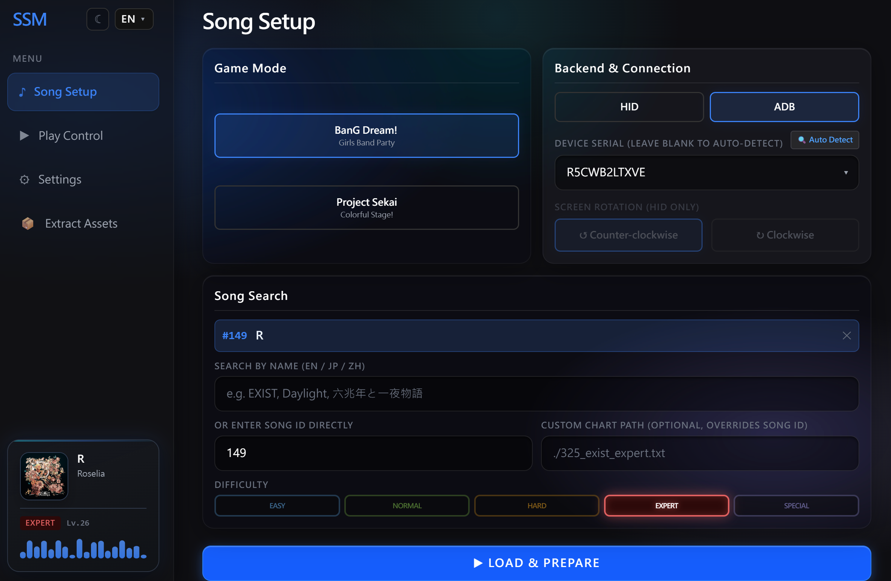

<p align="center">
    <a href="./">
        
    </a>
    <br>
    <strong>基于网页的音游自动打歌与谱面解析控制台</strong>
</p>


# SSM Web GUI Plus

本项目基于上游项目 [kvarenzn/ssm](https://github.com/kvarenzn/ssm) 的核心逻辑与架构进行扩展，并在 Web GUI 分支的基础上增加更多便捷功能。

支持 BanG Dream / Project Sekai（谱面解析 + 自动打歌 Web 控制台）。

## 相对原版新增内容（重点）

### ADB 投屏 / 触控（scrcpy 3.3.1）
- 使用 ADB forward + scrcpy-server v3.3.1（更适配部分 Android 14 设备）
- 修复 forward 模式 dummy byte / header 解析与视频包读取边界问题
- `/api/screen` 输出浏览器兼容的 MJPEG，并提供 `/api/screen?once=1` 单帧调试接口

### 自动启动（Vision）
- 7 点检测框可视化校准（Y / X / 点间距）
- 按钮式流程：开始检测 → 识别开局音符 → 自动开始 → 自动停止检测
- 支持“检测到后延迟开始”（可调 ms）


推荐使用流程：
- 进入 Play Control，先载入到 READY
- 调整 Detection Y / Detection X / 点间距，把 7 个检测框对齐判定线 7 轨
- 点击“开始检测”，检测到开局音符后会按你设置的“开始延迟”自动开始

### 其他
- 不全连/提前结束：在接近结尾时提前停止（可调提前时间）
- 前端 UI 文案支持多语言（简中/繁中/日/英）

## 功能截图

### 智能选歌


### 播放控制


## 使用建议
- 限于截图速度，流速太快了会跳帧检测不到，建议流速控制在7及以下效果比较好
- 同时节奏图标大小调大点也会好
- 调的好已经可以做到完美ap

## 快速开始

1. **下载**
   - 将 `release/windows-full/` 下载后解压即可使用。

2. **启动程序**
   - 双击 `ssm.exe`，或在终端运行：

     ```bash
     ./ssm.exe
     ```

   - 程序会尝试自动打开浏览器：`http://127.0.0.1:8765`（如未自动打开请手动访问）。

3. **准备手机/模拟器**
   - 手机用 USB 线连接电脑；模拟器请确认 ADB 可用。
   - 在手机上开启 **USB 调试 / ADB 调试**。
   - 检查设备连接：

     ```bash
     adb devices
     ```

4. **准备游戏资源**
   - 把游戏资源包复制到电脑并解压。
   - 同时把手机中的数据目录复制到电脑（以 BanG Dream 为例）：

     ```bash
     adb pull /sdcard/Android/data/jp.co.craftegg.band/files/data/
     ```

5. **在 GUI 中设置设备**
   - 进入 Settings 添加设备（序列号可自动检测/下拉选择）。
   - 选择连接方式：HID 或 ADB。

6. **载入并开始**
   - 按流程：Song Setup → Play Control → Start。
   - 若启用 Vision 自动启动：READY 后点击“开始检测”，检测到开局音符会自动开始。

> 仍支持传统命令行参数。更多说明可参考上游使用指南：  
> https://github.com/kvarenzn/ssm/blob/main/docs/USAGE.md

## 免责声明
本项目主要用于学习与研究，不保证功能的稳定性与适用性。

> [!IMPORTANT]
> 使用本项目可能违反相关游戏的服务条款，甚至导致封号或数据损坏。作者不对任何后果承担责任，请自行评估风险并谨慎使用。

## 开源协议与致谢
- 上游项目：kvarenzn/ssm（核心逻辑与谱面解析）
- 本项目许可：GPL-3.0-or-later
